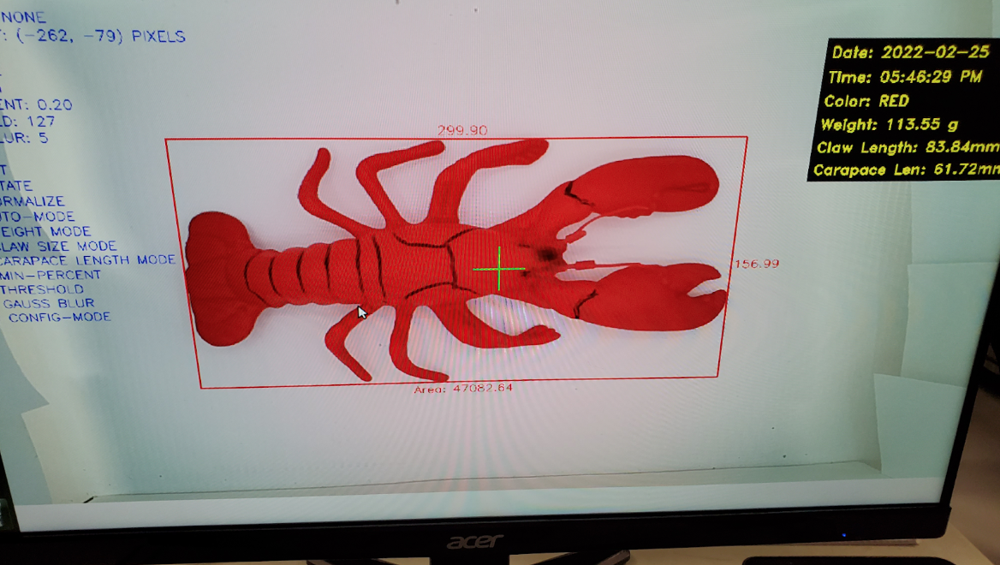
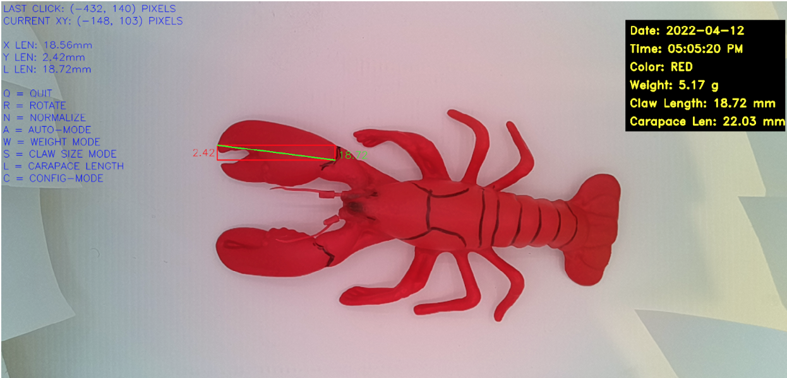
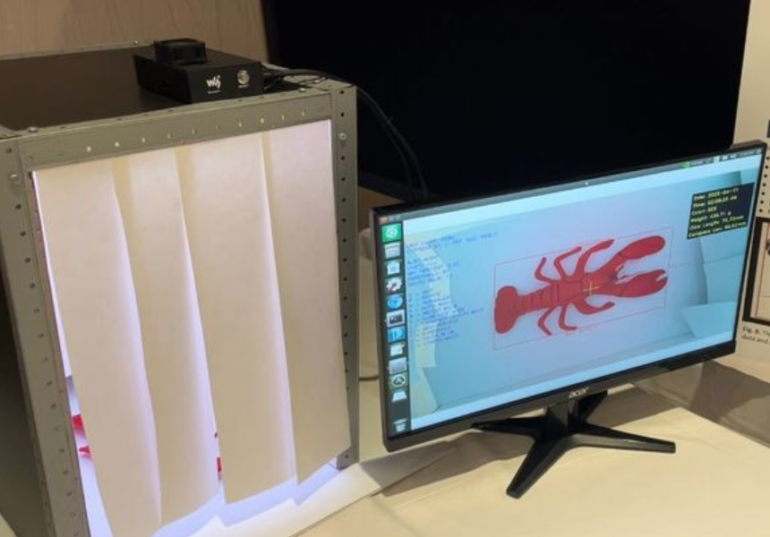

# Supply Chain Logistics Management and Traceability for Lobsters

## Description

In collaboration with the Modular Clinton Global's (MCG) Canadian team, a real-time image processing system was designed which is able to take measurements of multiple key attributes of a lobster which can be used for traceability. These attribute measurements are achieved with sufficient computing hardware based on MCG Canada's needs and image processing software.

The software for this project is written in python, using a number of libraries, to collect data,and make measurements using the camera. This program will perform multiple different operations to process and analyze the image obtained from the camera, to find desired characteristics. The captured data can be used for grading the lobster while producing high-quality data that can be input into prodcut tracebility and management.

